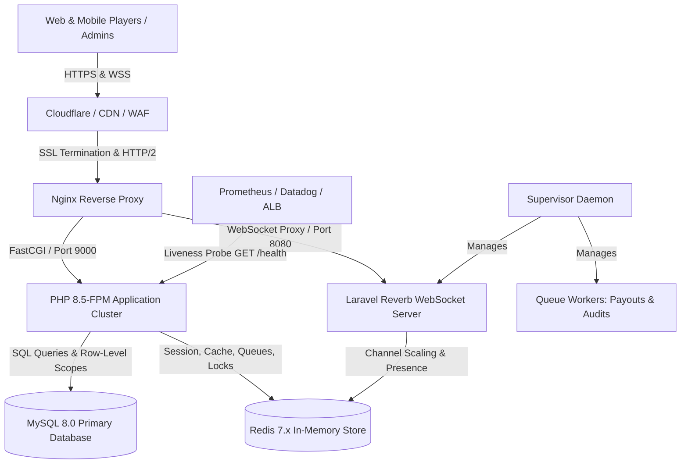

# Nobingo Production Readiness & Operations Manual

This document provides the definitive operational blueprint, security controls, observability standards, disaster recovery procedures, and service-level objectives for the **Nobingo 75-Ball Multi-Tenant SaaS Platform**.

---

## 1. System Architecture & Component Topology



### 1.1 Core Subsystems
- **Tenant Context (`App\Domains\Tenancy`)**: Global `CompanyScope` enforces row-level multi-tenancy. No company can access or view another company's cards, games, players, or ledger transactions.
- **Card Inventory (`App\Domains\Cards`)**: Pre-generated immutable 75-ball matrices validated and fingerprinted with SHA-256 hashes ($B \in [1,15], I \in [16,30], N \in [31,45], G \in [46,60], O \in [61,75]$ with center FREE square).
- **Game Engine & State Machine (`App\Domains\Games`)**: Server-authoritative game lifecycle transitions (`draft` $\to$ `open` $\to$ `starting` $\to$ `active` $\to$ `completed` / `cancelled`).
- **Cryptographic Calling (`App\Domains\Calling`)**: CSPRNG drawn numbers 1–75 with zero duplicates and deterministic server-side daub validation.
- **Real-Time WebSockets (`App\Domains\Reverb`)**: Instant broadcast of called numbers, presence channels, and winner declarations with transparent HTTP fallback polling.
- **Winner Verification (`App\Domains\Winners`)**: Transactional race-condition protection supporting `first_valid` and `simultaneous` tie policies.
- **Double-Entry Financial Ledger (`App\Domains\Financial`)**: Strict balance invariants where every transaction records `balance_before` and `balance_after`, ensuring zero mathematical drift and lossless jackpot distribution.
- **Health & Diagnostic Engine (`App\Domains\Health`)**: Automated subsystem probes, CLI audits, and monitoring interfaces.

---

## 2. Production Security Hardening & Compliance

### 2.1 Multi-Tenant Isolation
- Every tenant model implements `BelongsToCompany` trait.
- Cross-company route access is strictly rejected with HTTP 403 Forbidden.
- Platform Owner accounts (`PLATFORM_OWNER`) possess global cross-company oversight but cannot alter financial balances without audit records.

### 2.2 Rate Limiting Protection
Configured in `AppServiceProvider` and bound to high-frequency endpoints:
- `bingo.claim`: **30 requests / minute** (prevents automated claim flooding).
- `bingo.daub`: **120 requests / minute** (protects server resources during fast-paced calls).
- `wallet.operations`: **20 requests / minute** (guards deposit/withdrawal idempotency against replay attacks).

### 2.3 Authentication & Session Security
- Passwords hashed with `bcrypt` at 12 rounds.
- Session cookies enforced with:
  - `SESSION_SECURE_COOKIE=true` (HTTPS only transmission).
  - `SESSION_HTTP_ONLY=true` (prevents JavaScript access and XSS theft).
  - `SESSION_SAME_SITE=lax` (mitigates Cross-Site Request Forgery).
- Suspended player accounts are locked out instantly across HTTP endpoints and WebSocket channels.

---

## 3. Observability, Health Checks & Monitoring

### 3.1 HTTP Health Probe (`GET /health`)
- **Route**: `GET /health` (Public liveness/readiness probe for AWS ALB, Kubernetes, Google Cloud Load Balancer, or UptimeRobot).
- **HTTP 200 OK**: System is healthy or operating with non-critical warnings.
- **HTTP 503 Service Unavailable**: Critical dependency failure (Database unreachable or Cache unavailable).
- **Headers**: Returns `Cache-Control: no-cache, no-store, must-revalidate` to prevent CDN or proxy caching.

### 3.2 CLI Health Diagnostic (`php artisan bingo:health`)
Provides ANSI color-coded subsystem status tables for terminal inspection:
```bash
php artisan bingo:health
```

For integration into Prometheus, Datadog, or AWS CloudWatch:
```bash
php artisan bingo:health --json
```

```json
{
  "status": "healthy",
  "timestamp": "2026-09-28T21:00:00Z",
  "environment": "production",
  "checks": {
    "database": { "status": "healthy", "latency_ms": 4.12, "connection": "mysql" },
    "cache": { "status": "healthy", "latency_ms": 1.25, "store": "redis" },
    "queue": { "status": "healthy", "driver": "redis", "failed_jobs": 0, "pending_jobs": 2 },
    "reverb": { "status": "healthy", "broadcast_driver": "reverb", "server_host": "0.0.0.0", "server_port": 8080, "configured": true },
    "inventory": { "status": "healthy", "total_cards": 10000, "available_cards": 8500, "low_inventory_companies": [] },
    "ledger": { "status": "healthy", "audited_transactions": 200, "arithmetic_errors": 0, "user_discrepancies": 0 }
  }
}
```

### 3.3 Warning and Critical Alarm Thresholds
| Metric / Check | Nominal | Warning Threshold | Critical Alert | Action Plan |
|---|---|---|---|---|
| **Database Latency** | $< 50\text{ ms}$ | $> 250\text{ ms}$ | Connection refused | Check MySQL slow query log & connection pool |
| **Cache Latency** | $< 10\text{ ms}$ | $> 150\text{ ms}$ | Read/write failure | Inspect Redis CPU & memory saturation |
| **Failed Queue Jobs**| 0 | $> 25$ | $> 100$ | Run `php artisan queue:failed`, investigate worker logs |
| **Fixed Card Buffer** | $> 1,000$ | $< 50$ cards | 0 available | Run `php artisan bingo:cards:generate` immediately |
| **Ledger Invariants** | 0 errors | $\ge 1$ error | $\ge 1$ error | Run `php artisan bingo:inventory:audit` and lock tenant |

---

## 4. Cryptographic Asset & Financial Auditing

### 4.1 Automated Card & Ledger Integrity Audit
Nobingo provides a dedicated cryptographic auditor:
```bash
# Audit entire platform inventory and transactions
php artisan bingo:inventory:audit

# Audit a specific company tenant
php artisan bingo:inventory:audit --company=acme-bingo
```

**What it verifies:**
1. **SHA-256 Card Fingerprints**: Recomputes the canonical SHA-256 hash for all 5x5 card grids in `bingo_card_versions` and checks them against `card_hash`. Detects database corruption, manual tampering, or malicious card injection.
2. **Double-Entry Arithmetic Balance Invariant**: Recomputes the mathematical delta for every transaction record ($\text{balance\_after} = \text{balance\_before} \pm \text{amount}$) and confirms matching balances on `users.balance`.

---

## 5. Multi-Tenant Database Backup & Disaster Recovery

### 5.1 Automated Daily Backup Script (`backup-database.sh`)
```bash
#!/usr/bin/env bash
set -eo pipefail

BACKUP_DIR="/var/backups/nobingo"
TIMESTAMP=$(date +"%Y%m%d_%H%M%S")
FILENAME="nobingo_db_${TIMESTAMP}.sql.gz"

mkdir -p "$BACKUP_DIR"

# Perform consistent non-blocking database backup
mysqldump --host=127.0.0.1 --user=nobingo_app --password="YOUR_PASSWORD" \
    --single-transaction --quick --routines --triggers --events \
    nobingo_production | gzip -9 > "${BACKUP_DIR}/${FILENAME}"

# Sync encrypted backup to offsite S3 cold storage
# aws s3 cp "${BACKUP_DIR}/${FILENAME}" s3://nobingo-backups-cold-storage/mysql/

# Retain local backups for 14 days
find "$BACKUP_DIR" -type f -name "*.sql.gz" -mtime +14 -delete
```

### 5.2 Point-in-Time Recovery (PITR) Procedure
1. Locate the latest full baseline dump before the incident.
2. Restore the baseline dump into a staging or target database:
   ```bash
   gunzip < nobingo_db_20260928_020000.sql.gz | mysql -u root -p nobingo_production
   ```
3. Replay MySQL binary logs up to the exact target second:
   ```bash
   mysqlbinlog --stop-datetime="2026-09-28 14:15:00" /var/log/mysql/binlog.000123 | mysql -u root -p nobingo_production
   ```
4. Execute `php artisan bingo:inventory:audit` to verify card and ledger consistency.

### 5.3 Service Level Objectives (SLOs)
- **Target Availability (Uptime)**: **99.95%** ($< 21.6\text{ minutes}$ monthly downtime).
- **Recovery Time Objective (RTO)**: $< 30\text{ minutes}$ for complete disaster restore.
- **Recovery Point Objective (RPO)**: $< 5\text{ minutes}$ with continuous binary logging.
- **Real-Time WebSocket Latency**: $< 100\text{ ms}$ from server CSPRNG draw to player card notification.

---

## 6. Horizontal Scaling & High Availability Blueprint

When scaling beyond 10,000 concurrent active players:
1. **Reverb WebSocket Scaling**:
   - Set `REVERB_SCALING_ENABLED=true` in `.env`.
   - Reverb nodes communicate via Redis Pub/Sub channels to distribute events across multiple server instances.
2. **Stateless Web Nodes**:
   - Store all sessions and cache in Redis Cluster.
   - Point multiple web instances to central Redis and MySQL Multi-AZ primary.
3. **Queue Scalability**:
   - Scale Supervisor worker processes across multiple nodes (`numprocs=16`).
   - Isolate high-priority queues (`default`, `payouts`, `audits`).
